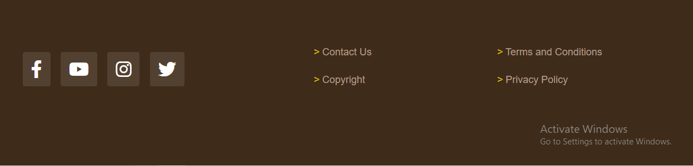

# Maggi First Page Clone

This repository contains a clone of the Maggi front page created using HTML and CSS. The clone aims to replicate the layout and design of the original Maggi website.

##Demo You can see a live demo of the project here: https://mca029043.github.io/MCT/

## Table of Contant

- Usage
- Features
- Contact
- Additional Information

## Usage

To view the Maggi Clone, follow these steps:

1. Clone the repository:
    ```shell
    https://github.com/MCA029043/MCT.git
    ```

2. Navigate to the project directory:
    ```shell
    cd MCT
    ```

3. Open the index.html file in your preferred web browser.
.

## Features

The Maggi Clone App offers the following features:

- Responsive design: The clone is designed to be responsive and optimized for different screen sizes.
- Section: there are many section. Some have same features so i gave them same class so that i can cantrol them at once
- Footer: Footer contain instagram, fb, twitter and youtube account so that you can contact.

## Contact

If you have any questions or suggestions, please feel free to contact us at:

- Email: ajaypotlia99@gmail.com
- Phone: 9996795380
- Website: https://mca029043.github.io/MCT/

## Additional Information

Here are some additional details about the Maggi Clone App:

- Tools Used: HTML, CSS
- Frameworks/Libraries: Bootstrap
- Tested Browsers: Google Chrome, Mozilla Firefox, Safari, Microsoft Edge

## Author

Ajay Potlia

## Screenshots

Here are some screenshots of the Maggi Clone App:



